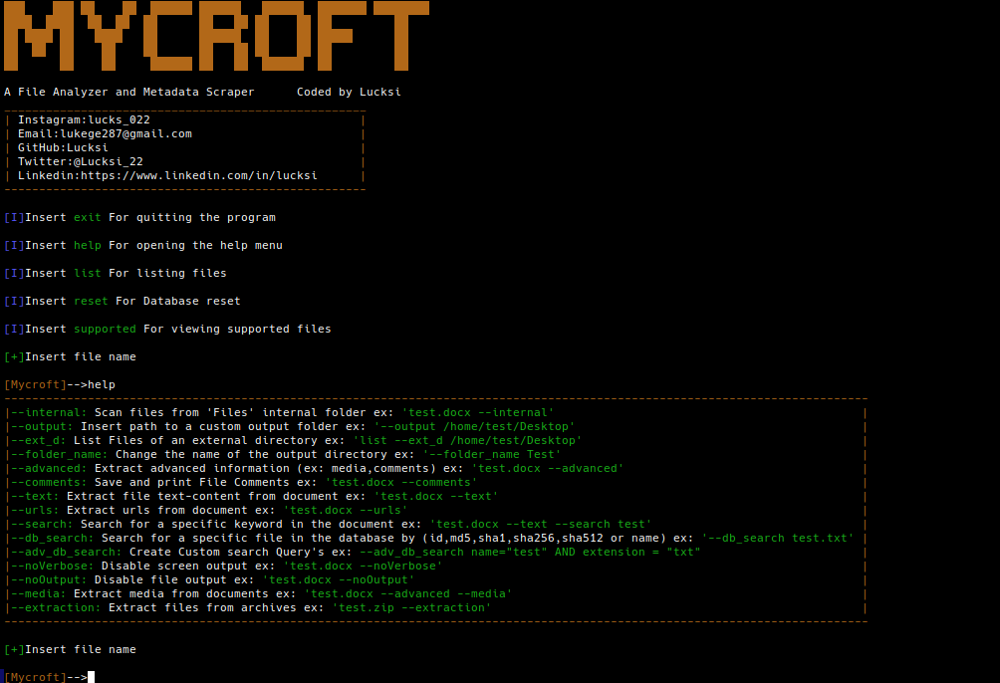
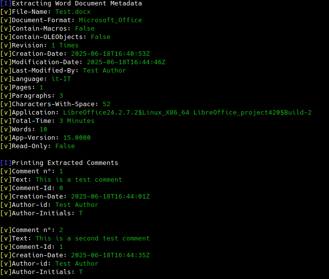
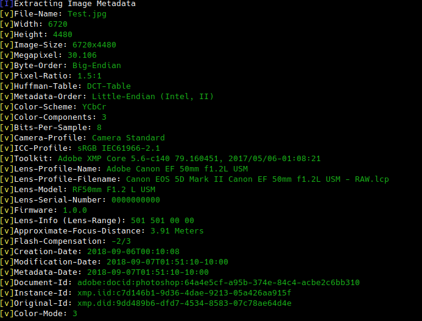

<p align = "center">

</p>

<p align = "center">
  
  
  
  
  
  
</p>

## Introduction

**Mycroft is a Offline File Analyzer and Metadata Scraper. Other than extracting metadata from a certain types of files it also a file analyzer which gives you extra information such as hashes,checksums and other file details.**

## Screenshot:


## Requirements:
```
Python3
```

## Installation Linux:
```bash
sudo apt-get update
sudo apt-get install python3
sudo apt-get install git
git clone https://github.com/Lucksi/Mycroft
```
## Execution:
```bash
cd Mycroft
python3 main.py
```
## Usage Example:

**After executing the program a simple query example is the following**
```bash 
/home/test/Desktop/example.pdf
```
**In case that an input folder is not specified the input folder will be the folder Files inside Mycroft folder with only the filename the program will extract only the metadata of the inserted file**

## Operating Sytstems:

| Platform | Tested |
| ------------- | ------------- |
| Linux  | ✅ |
| Mac-Os  | ❌ |
| Windows | ❌ |

## Optional Commands:

| Option name | Description | Query Example |
| ------------- | ------------- | -------------|
| `--internal`  | Scan files from 'Files' internal folder| test.docx --internal |
| `--output`  | Insert path to a custom output folder | --output /home/test/Desktop |
| `--ext_d`  | List Files of an external directory | list --ext_d /home/test/Desktop |
| `--folder_name`  | Change the name of the output directory | --folder_name Test |
| `--advanced`  | Extract advanced information from metadata | test.docx --advanced |
| `--comments`  | Extract comments from the document | test.docx --comments |
| `--text`  | Extract file text-content from document | test.docx --text |
| `--urls`  | Extract urls from the document | test.docx --urls |
| `--search`  | Search for a specific keyword in the document | test.docx --text --search Test |
| `--db_search`  | Search for a specific file in the database by (id,md5,sha1,sha256,sha512 or name) | --db_search test.txt |
| `--adv_db_search`  | Create Custom search Query's | --adv_db_search name="test" AND extension = "txt"|
| `--noVerbose`  | Disable screen output | test.docx --verbose
| `--noOutput`  | Disable file output | test.docx --noOutput |
| `--media`  | Extract media from documents| test.docx -- advanced --media
| `--extraction`  | Extract files from archives| test.zip --extraction

## Features:

| Description | File-Format |
| ------------- | ------------- |
| Extract metadata  | docx, pdf, xlsx, pptx, jpg, png, mp4, odt, odg, dotx, potx , docm , xlsm , pptm, odp, ods, zip, apk, jar, psd, gif, jps, bmp, tar.xz, tar.gz, tar.bz2|
| Get file hashes  | All formats |
| Get local informations  | All formats |
| Extract and Download media  | docx, pptx, odp, odt |
| Extract Text  | docx, pptx, xlsx, odt, odp, ods|
| Extract Comments  | docx, pptx, xlsx, odt, odp, ods|
| Extract Urls  | docx, pptx, xlsx, odt, odp, ods|
| Search Keyword  | docx, pptx, xlsx, odt, odp, ods|
| Extract files  | zip, apk, jar, tar.xz, tar.gz, tar.bz2 |
| Get archives file information  | zip, apk, jar |
| Get archive information  | zip, apk, jar |
| Get Pdf File Permission  | pdf |
| Recognize archive Compression Type  | zip, apk, jar |
| Recognize Password Protection  | zip, apk, jar|
| Recognize Shared File  | docx, pptx, xlsx |
| Recognize Suspicious keywords  | pdf |
| Recognize Encryption Algorithm  | pdf |

## Examples:

|    Docx Comment Extraction           |      Jpg Image Analysis         |
| ------------- | ------------- |
||  |

## File Hashing formats:

| Name | File-Format |
| ------------- |  ------------- |
| `MD5`  | all files except archive protected files |
| `SHA1`  | all files except archive protected files |
| `SHA256`  | all files except archive protected files |
| `SHA384`  | all files except archive protected files |
| `SHA512`  | all files except archive protected files |

## File Checksum formats:

| Name | File-Format |
| ------------- |  ------------- |
| `Crc32`  | All Formats |
| `Crc32-Control-Code`  | All Formats  |
| `Adler32-Checksum`  | All Formats  |

## Compression Algorithm:

| Name | Archive Format |
| ------------- |  ------------- |
| `Storage`  | zip, apk, jar |
| `Deflate`  | zip, apk, jar |
| `Enhanced Deflate`  | zip, apk, jar |
| `Bzip2`  | zip, apk, jar |
| `LZMA`  | zip, apk, jar |
| `Wavpack`  | zip, apk, jar |
| `JPEG`  | zip, apk, jar |
| `XZ`  | zip, apk, jar |
| `PPMD`  | zip, apk, jar |
| `AES`  | zip, apk, jar |

## STARGAZERS OVER TIME 

[](https://starchart.cc/Lucksi/Mycroft)

<br>

## <p align = center>  ORIGINAL CREATOR: <a href = "https://github.com/Lucksi">LUCA GAROFALO (Lucksi)</a></p>


## <p align = center>LICENSE: GPL-3.0 License <br>COPYRIGHT: (C) 2024-2025 Lucksi  
